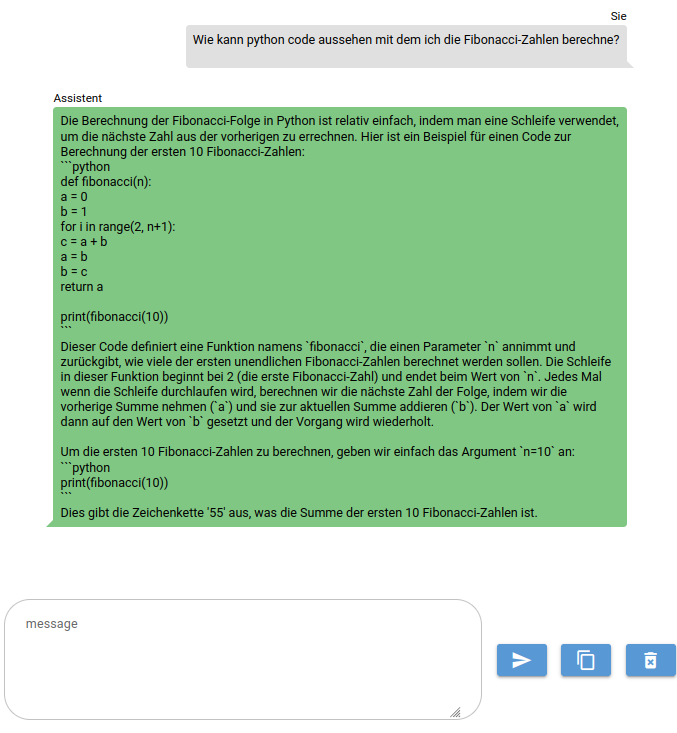

# News
Version 0.7 is current latest. It comes with a better gui, a config file, RAG and summarizing for PDF and fixes for RAG with GPU.

Version 0.5.1 is current latest. With this version, users can set custom llm parameters via the user interface.

# What it does? 
* With this repo you get a container which offers a local hosted llama based llm with gui access. No GPU required but you can use it with GPU support, if you have a GPU available.
* Models are downloaded on first time of usage and stored in an external mount.
* Chat history is held in memory only.

 

# What ressources do you need?
* The system uses as much CPU cores as you can provide. For acceptable performance 4 cores or more are recommended.
* Maximum RAM required is about 8 GB. In general less than 1 GB is used.

# How to use it?

* git clone https://github.com/bureaucratschoice/onpremchat.git
* go into the new directory onpremchat

## CPU only
* docker compose up - if you don't have docker-compose see below.
* By default, service is available under localhost:8000.
* A frontend to chat with the llm is available under localhost:8000/chat
* To learn about the api and try things out, connect to localhost:8000/docs

## GPU support
* docker compose -f docker-compose_gpu.yml up

# How to configure it?

* Configuration is done via environment variables. Default config loads a german fine tuned llm. 

## Configuration options general:
* SUPERTOKEN - The token for admin access to the api
* MODEL_DOWNLOAD_URL - The URL to download a model in GGUF format from.
* MODEL_BIN_PATH - The path of the model as /models/[OPTIONAL_SUBDIRECTORIES]/FILENAME

## Additional options for GPU image:
* GPU_LAYERS - The number of layers to load on GPU

# How to use it secure?
* Service provides basic security suitable for usage inside perimeter. It's not recommended to directly expose the service to the internet.

# How to install docker
If you don't have docker installed you find the links to the necessary steps below.
## CPU only
* install docker - https://docs.docker.com/engine/install/
* install docker-compose - https://docs.docker.com/compose/install/standalone/
## GPU support
* install GPU driver - https://docs.nvidia.com/datacenter/tesla/tesla-installation-notes/index.html
* install docker - https://docs.docker.com/engine/install/
* install docker-compose - https://docs.docker.com/compose/install/standalone/
* install nvidia container runtime - https://docs.docker.com/config/containers/resource_constraints/#gpu
